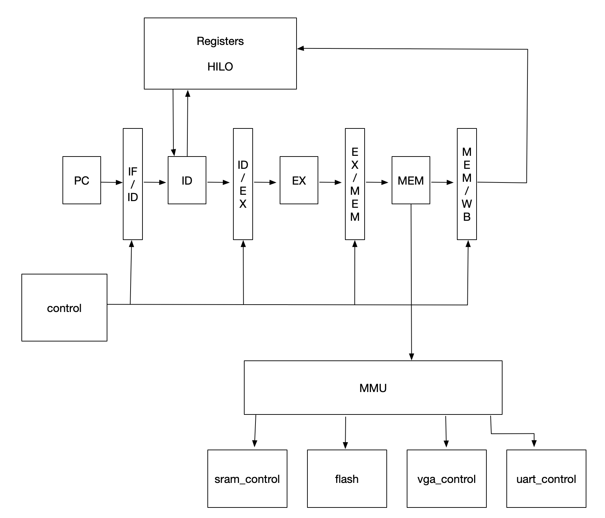

# 计算机组成原理 108组实验报告


## 1 项目简介

本项目是2018-2019秋季学期清华大学刘卫东老师计算机组成原理课程挑战组的实验项目。项目的设计要求、功能测例、监控程序和项目代码可以在同文件夹下找到。


### 1.1 项目成果

我们最终设计并实现了一个支持MIPS指令集的32位五级流水线CPU。具体功能包括：

* 支持共？条MIPS指令系统的基本指令

* 支持与CPU有关的异常、中断及TLB表查询
* 通过全部功能测例，并能运行监控程序，CPU主频达到50Mhz

* 支持相关的扩展外设，包括RAM读写、flash读写、串口读写、VGA图像输出等

* 编写了一个汇编语言游戏程序（贪吃蛇），并在cpu上运行


### 1.2 开发过程简介

与普通组的“奋战三星期，造台计算机”不同，挑战组项目贯穿整个2018-2019秋季学期。我们在此过程中研精覃思，夜以继日，最终的设计目标才得以完成，可谓“千淘万漉虽辛苦，吹尽狂沙始到金”。

#### 1.2.1 组队及分工

本组（108组）的三名组员及相应分工如下：

|  姓名  | 班级 |    学号    | 分工 |
| :----: | :--: | :--------: | :--: |
| 丁相允 | 计65 | 2016011361 |  ？  |
| 尹一帆 | 计65 |     ？     |  ？  |
| 阎静雅 | 计65 |     ？     |  ？  |

#### 1.2.2 开发流程

1. 第1周至第4周：组队，项目前期调研（向往届学长学姐咨询），学习计算机系统基本知识，确定开发语言，确定实验目标，初步模块划分及任务分工。
2. 第5周至第7周：编写CPU的基本架构，支持MIPS基本指令，ram读写，相关代码调试。
3. 第8周至第10周：编写异常处理部分、中断相关部分、TLB，相关代码调试。
4. 第11周至第14周：编写各外设模块，各部分独立调试。
5. 第15周：各部分协同联调，编写贪吃蛇汇编程序，项目展示。

#### 1.2.3 开发环境

##### 开发语言

我们使用Verilog语言完成本项目的开发。

我们曾经试图使用Chisel（由伯克利大学开发的基于Scala的硬件开发框架）进行开发。经过最开始的尝试，我们总结了chisel的如下优缺点：

优点：提供抽象的数据类型和接口，使用面向对象的方法，能够批量端口连接，简化开发过程，能直接通过sbt（Scala Build Tools）编译成Verilog语言。

缺点：学习成本高（需要学习Scala和Chisel并配置相应环境），仍需要手动编写逻辑电路，在小型项目上优势不明显，不支持高阻态等（可以通过内嵌Verilog代码解决），编译后的代码注入thinpad_top框架后难以调试。

综合以上分析，我们最终还是选择了Verilog。

##### 开发工具

我们使用Vivado 2018.1作为IDE。Vivado提供了便捷的verilog编写和仿真工具，并能生成bitstream直接导入FPGA芯片中，且与thinpad_top平台兼容性好。

我们使用清华大学计算机系的32位开发板进行实验。同时我们也使用了更加方便的在线实验平台。


## 2 项目设计


### 2.1 指令系统

我们完成的32位MIPS CPU共支持？条指令。各指令的格式、功能如下：

（+一个表格）


### 2.2 CPU基本设计图



各模块的详细介绍和功能可参见报告后面部分。


### 2.3 贪吃蛇游戏设计

为了充分展示CPU的功能，我们使用汇编语言编写了一个贪吃蛇游戏程序。贪吃蛇游戏是一款经典的益智游戏，既简单又耐玩，通过控制蛇头方向吃果实，从而使得蛇变得越来越长，当蛇撞到墙壁或自己的尾巴时，游戏结束。

为了在显示器中的相应位置显示颜色，我们采用CPU直接控制的方式写显存，即在汇编代码中使用SB指令到特定的地址。


## 3 CPU基本模块

我们的CPU采用单时钟信号，除flash模块外所有模块均采用50Mhz的时钟。因为flash本身读取速度较慢，故flash采用的是10Mhz时钟。


### 3.1 PC

#### 3.1.1 模块简介

PC即Program Counter，用于指示当前指令的位置，是CPU五级流水线中的第一段。本模块在执行完一条指令之后修改PC的值为下一条指令地址或需要跳转到的新的指令地址。

#### 3.1.2 接口信息

```verilog
module pc(
    input wire clk, // 50Mhz时钟信号
    input wire rst, // 复位信号
    
    input wire branchEnable_i,
    input wire [31:0] branchAddr_i,
    input wire [5:0] stall, // control的暂停信号
    input wire flush,
    input wire [31:0] exceptionHandleAddr_i,
    
    output reg [31:0] pc_o, // 传送到IF_ID阶段的PC值
    output wire [31:0] exceptionType_o,
    output wire pauseRequest
);
```

#### 3.1.3 实现细节

在无异常和暂停的情况下，每一个时钟上升沿到来时，`PC=PC+4`，即跳到内存中的下一条指令。


### 3.2 IF_ID

#### 3.2.1 模块简介

IF_ID模块连接PC模块和ID模块。在每一个时钟上升沿到来时，IF_ID模块将PC模块传来的数据传递给ID模块。

#### 3.2.2 接口信息

```verilog
module IF_ID(
    input wire clk, // 50Mhz时钟信号
    input wire rst, // 复位信号
    
    input wire [31:0] pc_i, // PC模块传来的PC值
    input wire [31:0] inst_i, // ？模块传来的32位指令
    input wire [5:0] stall, // control的暂停信号
    input wire flush,
    input wire [31:0] exceptionType_i, //
    
    output reg [31:0] pc_o, // 送至ID模块的PC值
    output reg [31:0] inst_o, // 送至ID模块的32位指令
    output reg [31:0] exceptionType_o //
);
```

#### 3.2.3 实现细节

每当一个时钟上升沿到来，该模块将pc、inst和exception三个变量的新的值传递给ID阶段。

如果control信号表明需要暂停，那么就？？？


### 3.3 ID

#### 3.3.1 模块简介

ID（Identify）模块即译码模块，负责识别指令类型、读取寄存器数据等，是CPU五级流水线的第二段。

#### 3.3.2 接口信息

```verilog
module ID(
    input wire clk, // 50Mhz时钟信号
    input wire rst, // 复位信号
    
    input wire [31:0] inst_i, // IF_ID模块传来的32位指令
    input wire [31:0] pc_i, // IF_ID模块传来的PC值
    
    // register模块传来的读取的两个寄存器数据
    input wire [31:0] readData1_i,
    input wire [31:0] readData2_i,
    
    input wire [31:0] exceptionType_i,
    
    // HILO模块传来的HI、LO寄存器数据
    input wire [31:0] HI_data_i,
    input wire [31:0] LO_data_i,
    
    //data from CP0
	input wire [31:0] CP0_data_i,
	input wire [31:0] cause_i,

    
    // EX阶段的数据旁路信号
    input wire [4:0] EX_writeAddr_i,
    input wire EX_writeEnable_i,
    input wire[1:0] EX_writeHILO_i,
    input wire [31:0] EX_writeHI_data_i,
    input wire [31:0] EX_writeLO_data_i,
    input wire EX_write_CP0_i,
    input wire [4:0] EX_write_CP0_addr_i,
    input wire next_in_delay_slot_i,
    
    // MEM阶段的数据旁路信号
    input wire [4:0] MEM_writeAddr_i,
    input wire MEM_writeEnable_i,
    input wire [1:0] MEM_writeHILO_i,
    input wire [31:0] MEM_writeHI_data_i,
    input wire [31:0] MEM_writeLO_data_i,
    input wire MEM_write_CP0_i,
    input wire [4:0] MEM_write_CP0_addr_i,
    
    //about the load conflict
    input wire [3:0] EX_ramOp_i,
    
    output reg [4:0] readAddr1_o,
    output reg [4:0] readAddr2_o,
    output reg readEnable1_o,
    output reg readEnable2_o,
    output reg [4:0] writeAddr_o,
    output reg writeEnable_o,
    
    output reg [1:0] writeHILO_o,
    
    output reg [31:0] oprand1_o,
    output reg [31:0] oprand2_o,
    output reg branchEnable_o,
    output reg [31:0] branchAddr_o,
    output reg [4:0] ALUop_o,
    output reg signed_o,
    
    output reg write_CP0_o,
	output reg [4:0] write_CP0_addr_o,
	output reg [4:0] read_CP0_addr_o,
    
    output wire [31:0] inst_o,
    output wire [31:0] pc_o,
    output reg in_delay_slot_o,
    output reg next_in_delay_slot_o,
    output wire [31:0] exceptionType_o,
    output reg pauseRequest
);
```

####3.3.3 实现细节


### 3.4 registers

#### 3.4.1 模块简介

registers模块包含了MIPS指令系统所需要的32个32位通用寄存器，并且提供了ID模块所需的2个读端口和WB模块所需的1个写端口。

#### 3.4.2 接口信息

```verilog
module registers(
    input wire clk, // 50Mhz时钟信号
    input wire rst, // 复位信号
    
    input wire readEnable1_i, // ID模块第一个读使能信号
    input wire readEnable2_i, // ID模块第二个读使能信号
    input wire[4:0] readAddr1_i, // ID模块第一个要读的寄存器地址
    input wire[4:0] readAddr2_i, // ID模块第二个要读的寄存器地址
    input wire writeEnable_i, // WB模块的写使能信号
    input wire[4:0] writeAddr_i, // WB模块要写的寄存器地址
    input wire[31:0] writeData_i, // WB模块要写入的数据
    
    output reg[31:0] readData1_o, // 读取的第一个寄存器数据，送至ID模块
    output reg[31:0] readData2_o, // 读取的第二个寄存器数据，送至ID模块
);
```

#### 3.4.3 实现细节

在程序中直接开辟寄存器空间：`reg[31:0] register[31:0];`

在每一个时钟上升沿到来时，需要写入WB模块的数据。直接将对应的register赋值为writeData即可。

在读取数据时，需要考虑数据冲突问题。如果要ID模块要读取的寄存器的地址恰好等于WB模块要写入的寄存器地址，即之前的某条指令要修改该寄存器的数值，那么就直接返回writeData。否则才返回寄存器中存储的值。

另外需要注意的是，0号寄存器的值永远是0。


### 3.5 ID_EX

#### 3.5.1 模块简介

ID_EX模块连接ID模块和EX模块。在每一个时钟上升沿到来时，ID_EX模块将ID模块传来的数据传递给EX模块。

#### 3.5.2 接口信息

```verilog
module ID_EX(
    input wire clk, // 50Mhz时钟信号
    input wire rst, // 复位信号
    
    input wire [4:0] ALUop_i,
    input wire [31:0] oprand1_i,
    input wire [31:0] oprand2_i,
    input wire [4:0] writeAddr_i,
    input wire writeEnable_i,
    input wire [1:0] writeHILO_i,
    input wire [5:0] stall,
    input wire signed_i,
    input wire [31:0] inst_i,
    input wire [31:0] pc_i,
    input wire next_in_delay_slot_i,
    input wire in_delay_slot_i,
    input wire [31:0] exceptionType_i,
    input wire write_CP0_i,
    input wire [4:0] write_CP0_addr_i,
    input wire flush,
    
    output reg [4:0] ALUop_o,
    output reg [31:0] oprand1_o,
    output reg [31:0] oprand2_o,
    output reg [4:0] writeAddr_o,
    output reg writeEnable_o,
    output reg [1:0] writeHILO_o,
    output reg signed_o,
    output reg [31:0] inst_o,
    output reg next_in_delay_slot_o,
    output reg in_delay_slot_o,
    output reg [31:0] exceptionType_o,
    output reg [31:0] pc_o,
    output reg write_CP0_o,
    output reg [4:0] write_CP0_addr_o
);
```

####3.5.3 实现细节


### 3.6 EX

#### 3.6.1 模块简介

EX模块负责进行算数运算和逻辑运算，是CPU五级流水线中的第三段。

#### 3.6.2 接口信息

```verilog
module EX(
    input wire clk, // 50Mhz时钟信号
    input wire rst, // 复位信号
    
    input wire [4:0] ALUop_i,
    input wire [31:0] oprand1_i,
    input wire [31:0] oprand2_i,
    input wire [4:0] writeAddr_i,
    input wire writeEnable_i,
    input wire [1:0] writeHILO_i,
    input wire signed_i,
    input wire [63:0] result_div_i,
    input wire success_i,
    input wire [31:0] inst_i,
    input wire [31:0] pc_i,
    input wire in_delay_slot_i,
    input wire [31:0] exceptionType_i,
    input wire write_CP0_i,
    input wire [4:0] write_CP0_addr_i,
    
    output reg [4:0] writeAddr_o,
    output reg writeEnable_o,
    output reg [1:0] writeHILO_o,
    output reg [31:0] HI_data_o,
    output reg [31:0] LO_data_o,
    
    output reg signed_o,
    output reg [31:0] dividend_o,
    output reg [31:0] divider_o,
    output reg start_o,
    
    output reg pauseRequest,
    
    output reg [31:0] storeData_o,
    output reg [3:0] ramOp_o,
    output reg in_delay_slot_o,
    output wire [31:0] exceptionType_o,
    output reg write_CP0_o,
    output reg [4:0] write_CP0_addr_o,
    output reg [31:0] pc_o
);
```

#### 3.6.3 实现细节


### 3.7 EX_MEM

#### 3.7.1 模块简介

EX_MEM模块连接EX模块和MEM模块。在每一个时钟上升沿到来时，EX_MEM模块将EX模块传来的数据传递给MEM模块。

#### 3.7.2 接口信息

```verilog
module EX_MEM(
    input wire clk, // 50Mhz时钟信号
    input wire rst, // 复位信号
    
    input wire [31:0] HI_data_i,
    input wire [31:0] LO_data_i,
    input wire [4:0] writeAddr_i,
    input wire writeEnable_i,
    input wire [1:0] writeHILO_i,
    input wire [5:0] stall,
    input wire [3:0] ramOp_i,
    input wire [31:0] storeData_i,
    input wire [31:0] pc_i,
    input wire in_delay_slot_i,
    input wire [31:0] exceptionType_i,
    input wire write_CP0_i,
    input wire [4:0] write_CP0_addr_i,
    input wire flush,
    
    output reg [4:0] writeAddr_o,
    output reg writeEnable_o,
    output reg [1:0] writeHILO_o,
    output reg [31:0] HI_data_o,
    output reg [31:0] LO_data_o,
    output reg [3:0] ramOp_o,
    output reg [31:0] storeData_o,
    output reg in_delay_slot_o,
    output reg [31:0] exceptionType_o,
    output reg write_CP0_o,
    output reg [4:0] write_CP0_addr_o,
    output reg [31:0] pc_o
);
```

####3.7.3 实现细节


### 3.8 MEM

#### 3.8.1 模块简介

MEM模块负责CPU的访存操作，是CPU五级流水线中的第四段。

#### 3.8.2 接口信息

```verilog
module MEM(
    input wire clk, // 50Mhz时钟信号
    input wire rst, // 复位信号
    
    input wire [4:0] writeAddr_i,
    input wire writeEnable_i,
    input wire [1:0] writeHILO_i,
    input wire [31:0] HI_data_i,
    input wire [31:0] LO_data_i,
    input wire write_CP0_i,
    input wire [4:0] write_CP0_addr_i,
    
    input wire [31:0] storeData_i,
    input wire [3:0] ramOp_i,
    input wire [31:0] load_data_i,
    input wire in_delay_slot_i,
    input wire [31:0] exceptionType_i,
    input wire [31:0] pc_i,
    
    input wire [31:0] CP0_status_i,
	input wire [31:0] CP0_cause_i,
	input wire [31:0] CP0_epc_i,
	input wire [31:0] CP0_ebase_i,
	input wire [31:0] CP0_index_i,
	input wire [31:0] CP0_random_i,
	input wire [31:0] CP0_entrylo0_i,
	input wire [31:0] CP0_entrylo1_i,
	input wire [31:0] CP0_entryhi_i,
	
	input wire WB_write_CP0_i,
	input wire [4:0] WB_write_CP0_addr_i,
	input wire [31:0] WB_write_CP0_data_i,

    output reg [4:0] writeAddr_o,
    output reg writeEnable_o,
    output reg [1:0] writeHILO_o,
    output reg [31:0] HI_data_o,
    output reg [31:0] LO_data_o,
    
    output reg [3:0] ramOp_o,
    output reg [31:0] ramAddr_o,
 	output reg [31:0] storeData_o,
 	output reg write_CP0_o,
 	output reg [4:0] write_CP0_addr_o,
 	output reg [31:0] exceptionType_o,
 	output wire [31:0] CP0_epc_o,
	output wire in_delay_slot_o,
	output wire [31:0] pc_o,
	output wire [31:0] CP0_ebase_o,
	output wire [31:0] CP0_index_o,
	output wire [31:0] CP0_random_o,
	output wire [31:0] CP0_entrylo0_o,
	output wire [31:0] CP0_entrylo1_o,
	output wire [31:0] CP0_entryhi_o,
	output reg tlbwi, tlbwr
);
```

#### 3.8.3 实现细节


### 3.9 MEM_WB

#### 3.9.1 模块简介

MEM_WB模块连接MEM模块和WB模块。WB模块是CPU五级流水线的第五段。由于WB模块没有实质的工作，故在CPU设计中将WB模块隐去了。

#### 3.9.2 接口信息

```verilog
module MEM_WB(
    input wire clk, // 50Mhz时钟信号
    input wire rst, // 复位信号
    
    input wire [4:0] writeAddr_i,
    input wire writeEnable_i,
    input wire [1:0] writeHILO_i,
    input wire [31:0] HI_data_i,
    input wire [31:0] LO_data_i,
    input wire [5:0] stall,
    input wire write_CP0_i,
    input wire [4:0] write_CP0_addr_i,
    input wire flush,
    
    output reg [4:0] writeAddr_o,
    output reg writeEnable_o,
    output reg [1:0] writeHILO_o,
    output reg [31:0] HI_data_o,
    output reg write_CP0_o,
    output reg [4:0] write_CP0_addr_o,
    output reg [31:0] LO_data_o
);
```

####3.9.3 实现细节


### 3.10 HILO

#### 3.10.1 模块简介

HILO模块由HI和LO两个32位寄存器组成，用于乘法和除法结果的存储。其实现方式、读写功能与register中的寄存器很相似，都要将数据传至ID模块，并由WB模块写入数据。

#### 3.10.2 接口信息

```verilog
module HILO(
	input wire clk, // 50Mhz时钟信号
	input wire rst, // 复位信号
    
    input wire [1:0] writeEnable_i, // WB模块写使能信号
    input wire [31:0] HI_data_i, // WB模块要写入HI寄存器的数据
    input wire [31:0] LO_data_i, // WB模块要写入LO寄存器的数据

    output reg [31:0] HI_data_o, // 送至ID模块的HI寄存器的数据
    output reg [31:0] LO_data_o // 送至ID模块的LO寄存器的数据
);
```

#### 3.10.3 实现细节

本模块的实现与register模块极为相似。定义两个32位寄存器HI和LO用于存储数据。在每一个时钟上升沿到来时，根据写使能信号的值将数据写入HI/LO寄存器中。在读取数据时也需要考虑同样的数据冲突问题。


### 3.11 div

#### 3.11.1 模块简介

div模块是专门用于实现除法的模块。除法指令无法在一个周期内完成，故需要将流水线暂停，进行除法运算，运算完成后返回结果，恢复流水线。

#### 3.11.2 接口信息

```verilog
module div(
	input wire clk, // 50Mhz时钟信号
	input wire rst, // 复位信号
    
	input wire signed_i,
	input wire [31:0] dividend_i,
	input wire [31:0] divider_i,
	input wire concell_i,
	input wire start_i,
	
	output reg [63:0] result_o,
	output reg success_o
);
```

#### 3.11.3 实现细节

使用一个状态机来实现除法功能。


### 3.12 control

#### 3.12.1 模块简介

control模块控制整个流水线的暂停信息。由于仅需要组合逻辑，不需要引入clk接口。

#### 3.12.2 接口信息

```verilog
module control(
	input wire rst, // 复位信息
    
	input wire stall_from_exe, // EX模块的暂停请求
	input wire stall_from_id, // ID模块的暂停请求
	input wire stall_from_mem, // MEM模块的暂停请求
	input wire stall_from_pc, // PC模块的暂停请求
	
	input wire [31:0] exceptionType_i,
	input wire [31:0] CP0_epc_i,
	input wire [31:0] CP0_ebase_i,
	input wire tlbmiss_i,
	/*stall[0] pc stall
	stall[1] IF stall
	stall[2] ID stall
	stall[3] EXE stall
	stall[4] MEM stall
	stall[5] WB stall*/
	output reg [5:0] stall,
	output reg flush,
	output reg [31:0] exceptionHandleAddr_o
);
```

#### 3.12.3 实现细节


### 3.13 defines.v

该文件中定义了各个模块中用到的常量信息，包括指令类型、跳转类型、运算类型等。


## 4 CPU扩展模块


### 4.1 MMU

#### 4.1.1 模块简介

MMU是CPU的内存管理模块，负责虚拟地址映射和TLB相关操作。

#### 4.1.2 接口信息

```verilog
module MMU(
	input wire clk, // 50Mhz时钟信号
	input wire rst, // 复位信号
    
	input wire [31:0] data_ramAddr_i,
	input wire [31:0] inst_ramAddr_i,
	input wire [3:0] ramOp_i,
	input wire [31:0] storeData_i,
	input wire [31:0] load_data_i,
	input wire [31:0] load_inst_i,
	input wire [31:0] entrylo0_i,
	input wire [31:0] entrylo1_i,
	input wire [31:0] entryhi_i,
	input wire [3:0] index_i,
	input wire [3:0] random_i,
	input wire tlbwi,
	input wire tlbwr,
	input wire [31:0] EX_ramAddr_i,
	input wire [31:0] uart_load_data_i,
	input wire dataReady,
	input wire writeReady,
	
	output reg [3:0] ramOp_o,
	output reg [31:0] load_data_o,
	output reg [31:0] load_inst_o,
	output reg [31:0] storeData_o,
	output reg [19:0] instAddr_o,
	output reg [19:0] dataAddr_o,
	output reg [1:0] bytes_o,
	output reg [3:0] uartOp_o,
	output reg [31:0] uart_storeData_o,
	output wire tlbmiss,
	output wire EX_tlbmiss,
	output wire load_o,
	
	output reg vga_we, // 送至vga_control阶段的显存写使能信号
    output reg [18:0] vga_addr, // 送至vga_control阶段的要写入显存的地址
    output reg [7:0] vga_data // 送至vga_control阶段的要写入显存的颜色数据
);
```

#### 4.1.3 实现细节

（？？？？）

当SB指令要写入的地址>=0x90000000时，即为写显存。


### 4.2 sram_control

#### 4.2.1 模块简介

sram_control模块负责控制CPU对两篇RAM的数据读写。该模块接收CPU的load或store操作，按照相应的时序读写RAM，并向CPU返回结果。

#### 4.2.2 接口信息

```verilog
module sram_control (
	input wire clk, // 50Mhz时钟信号
	input wire rst, // 复位信号
    
	input wire [19:0] dataAddr_i,
	input wire [19:0] instAddr_i,
	input wire [31:0] storeData_i,
	input wire [3:0] ramOp_i,
	input wire [1:0] bytes_i,
	
	input wire [3:0] EX_ramOp_i,
	input wire [31:0] EX_ramAddr_i,
	input wire EX_tlbmiss_i,
	
	output reg [31:0] loadInst_o,
	output reg [31:0] loadData_o,
	output reg base_we_n_o, base_ce_n_o, base_oe_n_o,
	output reg [3:0] base_be_n_o,
	output reg ext_we_n_o, ext_ce_n_o, ext_oe_n_o,
	output reg [3:0] ext_be_n_o,
	output reg [19:0] instAddr_o,
	output reg [19:0] dataAddr_o,
	output reg pauseRequest, // 送至control模块的暂停信号
	
    inout wire [31:0] inst_io, // 连接至外部引脚的Ext Ram数据总线
    inout wire [31:0] data_io // 连接至外部引脚的Base Ram数据总线
);
```

####4.2.3 实现细节


### 4.3 CP0

#### 4.3.1 模块简介

CP0是协处理器，负责记录CPU 的各种参数、属性和运行状态，在异常处理和中断处理中起到重大作用。

#### 4.3.2 接口信息

```verilog
module CP0(
	input wire clk, // 50Mhz时钟信号
	input wire rst, // 复位信号
    
	input wire writeEnable_i,
	input wire [4:0] writeAddr_i,
	input wire [31:0] writeData_i,
	input wire [4:0] readAddr_i,
	input wire [5:0] int_i, //hardware interuptions
	input wire [31:0] exceptionType_i,
	input wire [31:0] exceptionAddr_i,
	input wire in_delay_slot_i,
	input wire [31:0] badVaddr_i,
	input wire tlbmiss_i,
	input wire load_i,
	
	output reg [31:0] readData_o,
	output reg [31:0] status_o,
	output reg [31:0] epc_o,
	output reg [31:0] cause_o,
	output reg [31:0] ebase_o,
	output reg [31:0] badVaddr_o,
	output reg [31:0] index_o,
	output reg [31:0] random_o,
	output reg [31:0] entrylo0_o,
	output reg [31:0] entrylo1_o,
	output reg [31:0] pagemask_o,
	output reg [31:0] config_o,
	output reg [31:0] entryhi_o,
	output reg [31:0] context_o
);
```

####4.3.3 实现细节


### 4.4 uart_control

#### 4.4.1 模块简介

Uart_control是串口控制模块。

#### 4.4.2 接口信息

```verilog
module uart_control(
	input wire clk, // 50Mhz时钟信号
	input wire rst, // 复位信号
    
	input wire rxd,
	input wire [31:0] storeData,
	input wire [3:0] uartOp_i,
	input wire [3:0] EX_uartOp_i,
	input wire [31:0] EX_addr_i,
	
	output wire txd,
	output reg [31:0] loadData_o,
	output reg pauseRequest,
	output wire dataReady,
	output wire writeReady
);
```

####4.4.3 实现细节


### 4.5 vga_control

#### 4.5.1 模块简介

此模块控制CPU的视频输出信号。在此模块中，VGA周期地访问显存，并将显存中读取出的颜色数据输出。同时还接收MMU传递的写显存信号，修改显存中某点的颜色值。

#### 4.5.2 接口信息

```verilog
module vga_control(
    input wire clk, // 50Mhz时钟信号
    input wire rst, // 复位信号
    
    // 连接到外部引脚的vga控制信号
    output wire[2:0] video_red,
    output wire[2:0] video_green,
    output wire[1:0] video_blue,
    output wire video_hsync,
    output wire video_vsync,
    output wire video_clk,
    output wire video_de,
    
    input wire img_show, // 是否要从flash中读取图片并展示
    
    output reg vga_re, // flash读使能信号
    output reg [22:0] vga_addr, // 要读取的flash地址
    input wire [15:0] vga_data, // 读出的flash数据
    input wire vga_success, // flash读取成功标志
    
    input wire write_enable, // 写显存使能信号
    input wire [18:0] write_address, // 写显存地址
    input wire [7:0] write_data // 写入显存的数据
);
```

#### 4.5.3 实现细节

因为显存需要的存储容量太大（$800*600*8$），不可能通过在FPGA中直接开辟这么大的空间来存储。在这个问题上我们思考了很久，也参考了其他同学的做法，最终决定使用Xilinx芯片自带的片内资源：IP核Block Ram来作为显存。Vivado支持直接开辟bram，并且给出了相应的调用方法：

```verilog
blk_mem_gen_0 bram (
    .clka(clk),    // input wire clka
    .ena(ena),      // input wire ena
    .wea(wea),      // input wire [0 : 0] wea
    .addra(addra),  // input wire [18 : 0] addra
    .dina(dina),    // input wire [7 : 0] dina

    .clkb(clk),    // input wire clkb
    .enb(enb),      // input wire enb
    .addrb(addrb),  // input wire [18 : 0] addrb
    .doutb(doutb)  // output wire [7 : 0] doutb
);
```

我们使用的是一个简单双口RAM，A口用来写数据，B口用来读数据。bram的数据宽度为8（RGB颜色的宽度），数据深度为480000，即800*600，分别对应输出信号的一个像素点，从上到下一行一行地扫描。

我们在代码中也调用了thinpad_top自带的vga模块进行视频输出。只需要在相应的hdata和vdata到来时，从bram的B口中读取相应位置的数据即可。但是，bram读取数据需要一个周期，而我们必须在hdata和vdata到来的同时送出颜色信号。为了解决这个问题，我们的实现是根据hdata和vdata计算出下一个扫描像素的位置，并将addrb设为相应的地址。这样在下一时钟上升沿到来时，doutb读出的数据就正好是hdata和vdata所对应的颜色。

bram的A口用来写入MMU传来的数据。MMU中的数据是相应的SB指令传来的。写显存时只需将addra设为要写的地址，将wea置1即可。

我们的接口中还有一个img_show信号，用来判断当前是要从flash中读取图片并展示，还是要运行贪吃蛇程序玩游戏。当img_show为true时，vga_control将向flash传递信号，将flash中的图片像素数据依次读出并存储到显存中。通过init_end信号判定是否读取完毕。具体实现可参见相关代码。


### 4.6 flash

#### 4.6.1 模块简介

flash模块控制flash的读写操作。本模块直接使用了之前小实验的代码，故为VHDL语言编写。在最终展示的版本中，vga_control模块将连接到flash模块，以从flash中读取图片。flash模块还有若干与thinpad_top相连的控制接口，直接对应到FPGA芯片的引脚上。

#### 4.6.2 接口信息

```vhdl
Port (
    ctl_read : in std_logic; -- vga_control模块传来的读使能信号
    addr : in  STD_LOGIC_VECTOR (22 downto 0); -- 从vga_control模块传来的读数据地址
    data_out : out  STD_LOGIC_VECTOR (15 downto 0); -- 传递给vga_control模块的数据
    success: out std_logic; -- 读取成功标志
			  
	clk : in std_logic; -- 10Mhz时钟信号
	reset : in std_logic; -- 复位信号
			  
    -- 连至外部引脚的flash控制信号
    flash_byte : out std_logic;
    flash_vpen : out std_logic;
    flash_ce : out std_logic;
    flash_oe : out std_logic;
    flash_we : out std_logic;
    flash_rp : out std_logic;
    flash_addr : out std_logic_vector(22 downto 0);
    flash_data : inout std_logic_vector(15 downto 0)
);
```

#### 4.6.3 实现细节

我们使用一个状态机来实现flash的读取功能。状态转移图如下：


每一次读取flash都需要经过五个状态。最终将success信号置1，同时data_out将读出的数据送出。读flash的信号时序与课本中介绍的相同，在此不再赘述。


## 5 其他相关代码


### 5.1 对实验框架的修改

最终的实验框架结构如下图：


对原有框架的修改主要是在thinpad_top中加入我们编写的CPU：

```verilog
CPU CPU0(
	.clk(clk_50M),
	.clk_11M(clk_11M0592),
    .rst(reset_btn),
    .btn(touch_btn),
    
    .dip_sw(dip_sw),
    
    // 两块ram的连线
    .instAddr_o(ext_ram_addr),
	.dataAddr_o(base_ram_addr),
	
	.inst_WE_n_o(ext_ram_we_n),
	.inst_OE_n_o(ext_ram_oe_n),
	.inst_CE_n_o(ext_ram_ce_n),
	.inst_be_n_o(ext_ram_be_n),
	
	.data_WE_n_o(base_ram_we_n),
	.data_OE_n_o(base_ram_oe_n),
	.data_CE_n_o(base_ram_ce_n),
	.data_be_n_o(base_ram_be_n),
		
	.data_io(base_ram_data),
	.inst_io(ext_ram_data),
	
    // 实验板上的LED和数码管连线
	.led_o(leds),
	.dpy0_o(tmp0),
	.dpy1_o(tmp1),
	
	.rxd(rxd),
	.txd(txd),
	
    // VGA相关连线
	.video_red(video_red),
	.video_green(video_green),
	.video_blue(video_blue),
	.video_hsync(video_hsync),
	.video_vsync(video_vsync),
	.video_clk(video_clk),
	.video_de(video_de),
	
    // flash相关连线
    .flash_a(flash_a),
    .flash_d(flash_d),
    .flash_rp_n(flash_rp_n),
    .flash_vpen(flash_vpen),
    .flash_ce_n(flash_ce_n),
    .flash_oe_n(flash_oe_n),
    .flash_we_n(flash_we_n),
    .flash_byte_n(flash_byte_n)
);
```

另外，我们还修改了`tb.sv`中的`BASE_RAM_INIT_FILE`、`EXT_RAM_INIT_FILE`、`FLASH_INIT_FILE`参数，便于在仿真时进行调试。另外我们增加了ip核bram作为显存（上文中提到过）。除此之外，我们没有对thinpad_top原有代码的其他部分做修改。


### 5.2 图片格式转换

因为实验板的VGA输出是3位Red，3位Green，2位Blue，普通的图片没有这种格式的，故需要我们进行转换。我们使用python将图片转换为二进制，然后存储到flash中。转换核心代码如下：

```python
filename = sys.argv[1]
img = Image.open(filename)
img = img.resize((800, 600),Image.ANTIALIAS)
img.save(filename+'_resize.png','png')

file = open(filename[0:-4]+'.bin','wb')
for i in range(600):
    for j in range(800):
        color=img.getpixel((j,i))
        R = color[0] // 32
        G = color[1] // 32
        B = color[2] // 64
        s = struct.pack('B', R*32+G*4+B)
        file.write(s)
file.close()
```

首先将图片转为800*600大小，然后对于每一个像素的RGB值，其范围本来为[0,255]，通过除以32或64即可将其转换为相应的二进制表示。最后通过`struct.pack`函数写到bin文件中。最后将bin文件导入flash，运行cpu，就可以在显示器中显示图片。

由于最后阶段时间紧，我们没有做视频相关的处理，但我们对视频输出做了基本的设计构想，即采用一些视频压缩算法将视频存入flash，然后使用硬件将视频解压，通过与显示图片相同的方法即可在显示器中播放。


### 5.3 贪吃蛇汇编程序

（？？？）


## 6 实验成果展示


### 6.1 通过功能测例

（？？？）


### 6.2 运行监控程序

（？？？）


### 6.3 从flash读取并展示图片

在线实验平台上的效果如图：


### 6.4 贪吃蛇游戏

（？？？）


## 7 实验总结


### 7.1 CPU设计总结

在实验的设计阶段，我们咨询了许多造过计算机的先辈们，并参考了众多教科书和网上资料，中途不断改正，才形成了最终的CPU设计版本。在此过程中遇到的问题和总结如下：

* 开始时可以先不确定各个模块的接口，可以在开发的过程中随功能的变化添加。据我们了解，普通组的开发过程是先设计好了数据通路，然后再开发各个模块。但我们组借鉴了《自己动手写CPU》中的方法，开始时只是大致画出了CPU设计图，在随后的开发过程中再明确各个接口。当然，设计阶段必须对每个模块的功能认识明确，对整个CPU如何工作有总体的理解。
* 在明确指令系统的过程中，我们组员对其中有些指令的理解有误，对后续的开发过程中造成了麻烦。遇到这种问题时不建议上网搜索，因为网上的内容错综复杂，还有可能涉及MIPS的版本等问题。最好的办法就是直接阅读MIPS文档，其中对各条指令的形式、功能都有极为详细的描述。


### 7.2 开发过程总结

大三上学期是计算机系课业最为繁重的一个学期，除造计算机外，我们还有软件工程课的大作业、编译原理课的编译器、网络原理课的路由器等等需要开发的工作。开发过程中我们遇到的问题及总结如下：

* 确定好开发时间，拒绝拖延。在第一次检查之前，我们面临许多项作业的deadline，本项目只进行了设计分工工作。于是在检查前的几天里，我们通宵达旦、夜以继日，终于支持了MIPS的基本指令。但我们也进行了反思：欲速则不达，一定要合理规划开发时间。在之后的几周，我们一般采用每周3天，每天若干小时的方式开发，既提高了开发效率，又保证了身体健康。

* 循序渐进，敏捷开发。虽然我们不是计原软工联合项目组，但软件工程课中所学到的诸多知识如使用git管理代码，迭代开发，敏捷开发等对我们此项目有莫大的帮助。使用git进行版本控制，使我们能够多人同时开发不同的部分。而敏捷开发所提倡的沟通交流也十分重要，包括小组成员之间的沟通，以及与老师和助教的沟通。我们的项目最终有近万行代码，中间过程中修改、重写、丢弃的代码更是不计其数，但总量虽多，只要制定好开发计划，在git的帮助下最终也取得了成功。借用《自己动手写CPU》中的一段话：

  >在实现OpenMIPS处理器的过程中，笔者深刻体会到“罗马非一日建成”这句话，外表看起来巨大、庞杂的罗马，也是通过人们一步一步、一天一天、一点一点建成的，处理器也是如此，读者首先不要被处理器的神秘吓到，从最简单的地方入手，逐渐增加功能、完善设计，一行代码一行代码地书写，不仅要有实现处理器的远大目标，还要确立切实可操作的短期目标，比如本周实现除法指令，下周实现转移指令，诸如此类，等有一天你突然回头，会发现，原来已经走了那么远，实现了那么多功能。李白有诗云：两岸猿声啼不住，轻舟已过万重山。当是此意。

* 在开发过程中我们多次遇到了仿真结果与在板子上运行结果不一致的情况。在经历了诸多痛苦的调试过程后，我们总结了以下几点可能的原因：代码中的latches没有消除；代码中连线错误，可能一个信号对应了多根线；reg和wire的使用错误；时序没有理清楚。硬件上的问题是我们以前的程序设计中从来没有遇到过的，因此犯了很多错，踩了很多坑。不过只要仔细检查，总能发现程序中的错误。同样，在写代码的阶段不能贪图快，也要注重代码质量。


### 7.3 心得体会

世界上第一台计算机ENIAC每秒只能进行5000次计算，而当今小小的手机计算能力都远超它。从图灵、冯诺依曼的时代开始，一代代的计算机科学家们呕心沥血，继往开来，才让今天的计算机硬件系统如此的精妙，功能如此的强大。在本项目里，我们用自己的双手实现了一个简单的32位CPU。虽然这在历史上早已被实现过，也不是什么困难的事情，但在这其中我们深刻体会到了计算机系统结构的博大精深，也让我们对计算机先贤们肃然起敬。科技的进步，在未来或许也需要我们的一份力量。

光阴似箭，日月如梭，一学期的课程终于结束了。造计算机，这所有贵系人都要经历的一道坎，我们也终于平安度过。虽然我们离”深入理解计算机体系结构“还有很远，但一个简单的CPU，便也是我们努力的见证。

最后借用《自己动手写CPU》中的一段话作为本项目的总结：

>一个人的旅行是孤单的
>
>一个人的冬季是寒冷的
>
>但是
>
>一个人的CPU是骄傲的
>
>让我们骄傲一次


## 8 附录


### 8.1 上交文件列表

```
.
├── code
├── image
│   └── CPU.png
├── report.md
└── 大实验报告要求.png
```


### 8.2 参考资料

刘卫东老师计算机组成原理课件

《自己动手写CPU》雷思磊著，电子工业出版社

挑战组网站http://os.cs.tsinghua.edu.cn/oscourse/CCP2017上的相关资料，包括功能测例资料、监控程序资料、32位实验板说明、RAM文档、flash文档、VGA文档

往届软工文档（李北辰和谢磊组文档，逆光组文档）

MIPS32 Architecture For Programmers（共三卷）


### 8.3 鸣谢

感谢刘卫东老师为我们生动地讲解计算机结构知识，为CPU的实现打下了坚实的基础。

感谢李山山老师、杨松涛助教、张宇翔助教为本课程的付出，尤其是最后一位帮助我们解决了实验中遇到的问题。

感谢清华大学计算机系为我们提供这样一门有趣并极具挑战性的课程。